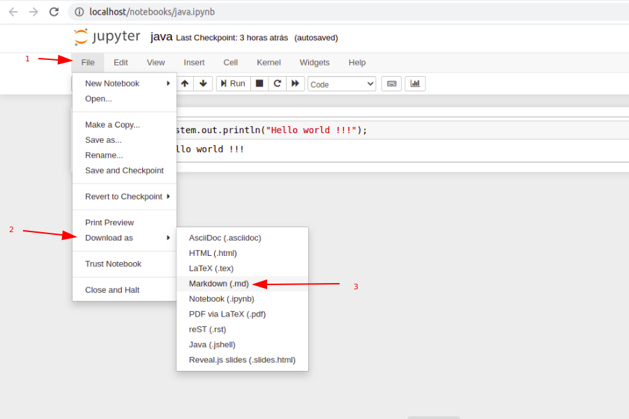

# Pré requisitos
- Ter o docker e docker-compose instalados na máquina. (se não tiver basta seguir este link https://docs.docker.com/compose/install/)

# Rodando com o Docker Compose
- Criar um arquivo .env na raiz do projeto (basta copiar ou renomear o arquivo .env.example). Nele, você pode escolher a porta que será mapeada para o jupyter-notebook e para o docsify (ferramenta usada para criar o site) que estarão rodando no docker
- Para rodar o projeto com o docker, basta executar o comando ```docker-compose up```
- Para acessar o notebook, basta acessar o localhost da sua máquina, na porta definida no .env (por padrão apenas ```localhost```)
- Para acessar o site, basta acessar o localhost da sua máquina, na porta definida no .env (por padrão ```localhost:8080```)

# Menu
- No arquivo _navbar.md é possível adicionar novos links no menu seguindo o padrão que já está sendo usado com nome do link e caminho relativo para o destino.
- É possível gerar arquivos markdown de um jupyter notebook (sessão abaixo) e assim gerar arquivos estáticos.
- Existe um link para o binder que irá gerar um notebook online para todos os arquivos que estão dentro de /app que poderá ser editável pelo usuário

# Gerando arquivos Markdown pelo jupyter notebook
Para criar novos arquivos, com o código compilado no notebook, basta fazer o download do arquivo com o formato .md


# Observações
- Todos os arquivos markdown serão lidos pelo docsify que vai renderizar na tela sem necessidade de editar arquivos html, basta criar os links desses arquivos para que seja possível acessar através do menu (ou até de outro arquivo .md)
- O github pages atualiza automaticamente a página de acordo com a branch master e todas as atualizações na branch serão refletidas lá.
